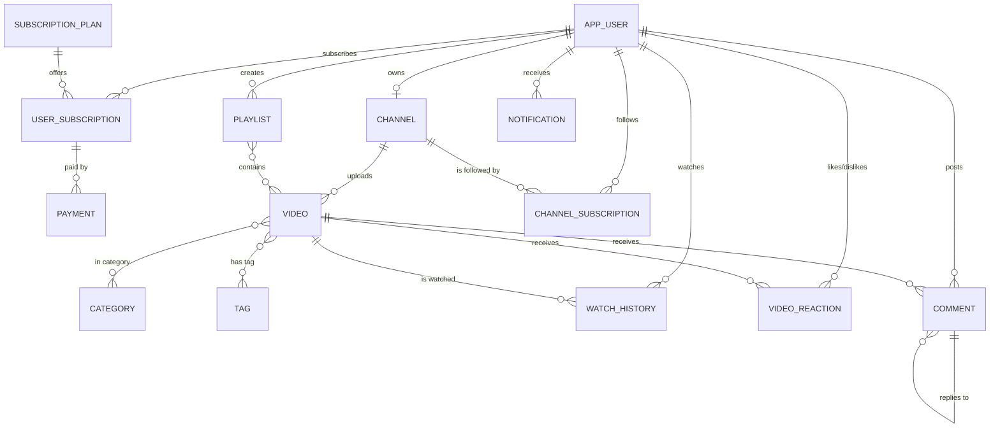

# Entity-Relationship Diagram (ERD)

The StreamFlix database captures the following real-world entities and relationships.

## 1. Entity Sets

### Strong entities
| Entity | Primary Key | Description |
|--------|-------------|-------------|
| `app_user`           | `user_id`        | A person using the platform (viewer / creator / admin). |
| `subscription_plan`  | `plan_id`        | Platform-wide paid plan (Free, Basic, Premium…). |
| `channel`            | `channel_id`     | A creator's channel (1 user → 1 channel). |
| `category`           | `category_id`    | High-level genre (Music, Tech, …). |
| `tag`                | `tag_id`         | Fine-grained keyword for search. |
| `video`              | `video_id`       | A video uploaded to a channel. |
| `comment`            | `comment_id`     | Comment on a video, supports replies (self-relationship). |
| `playlist`           | `playlist_id`    | A user-created collection of videos. |
| `notification`       | `notification_id`| System/user event for a user. |
| `payment`            | `payment_id`     | Payment event for a subscription. |

### Weak entities / relationship tables
| Table | PK | Depends on |
|-------|----|-----------|
| `user_subscription`   | `subscription_id`                  | `app_user`, `subscription_plan` |
| `watch_history`       | `history_id`                       | `app_user`, `video` |
| `video_reaction`      | (`user_id`, `video_id`)            | `app_user`, `video` |
| `channel_subscription`| (`subscriber_user_id`, `channel_id`)| `app_user`, `channel` |
| `video_category`      | (`video_id`, `category_id`)        | M:N link |
| `video_tag`           | (`video_id`, `tag_id`)             | M:N link |
| `playlist_video`      | (`playlist_id`, `video_id`)        | `playlist`, `video` |

## 2. Relationships and Cardinalities

| Relationship | From | To | Cardinality |
|--------------|------|----|-------------|
| *subscribes_to*     | app_user  → subscription_plan | M : N (via `user_subscription`, total on app_user) |
| *owns*              | app_user  → channel           | 1 : 1 (channel may be optional) |
| *uploads*           | channel   → video             | 1 : N |
| *categorized_as*    | video     → category          | M : N |
| *tagged_with*       | video     → tag               | M : N |
| *watches*           | app_user  → video             | M : N (via `watch_history`) |
| *reacts_on*         | app_user  → video             | M : N (via `video_reaction`) |
| *subscribes_channel*| app_user  → channel           | M : N (via `channel_subscription`) |
| *comments_on*       | app_user  → video             | M : N (via `comment`) |
| *replies_to*        | comment   → comment           | 1 : N (self) |
| *creates*           | app_user  → playlist          | 1 : N |
| *contains*          | playlist  → video             | M : N (via `playlist_video`) |
| *receives*          | app_user  → notification      | 1 : N |
| *pays_for*          | user_subscription → payment   | 1 : N |

## 3. ER Diagram (Mermaid)



## 4. Key Attributes (simplified)

```
app_user (user_id PK, username UNIQUE, email UNIQUE, password_hash,
          full_name, date_of_birth, country, avatar_url, role, is_active,
          created_at, last_login)

channel  (channel_id PK, owner_user_id FK UNIQUE,
          channel_name, description, banner_url, subscriber_count, created_at)

video    (video_id PK, channel_id FK, title, description,
          video_url, thumbnail_url, duration_sec, resolution,
          views_count, likes_count, dislikes_count,
          status, is_premium, upload_date)

comment  (comment_id PK, video_id FK, user_id FK, parent_comment_id FK,
          content, likes_count, created_at)

watch_history (history_id PK, user_id FK, video_id FK,
               watched_at, watch_duration, progress_pct, device_type)
```

## 5. Constraints captured in the ERD

- **Primary keys** are underlined in each entity.
- **Total participation** on `channel.owner_user_id` (every channel must have an owner).
- **Weak entity**: `watch_history` doesn't exist without both its `app_user` and `video` parents.
- **Self-relationship** on `comment.parent_comment_id` for replies.
- **Check constraints** on `email` format, `duration_sec > 0`, `price >= 0`, `end_date > start_date`.
